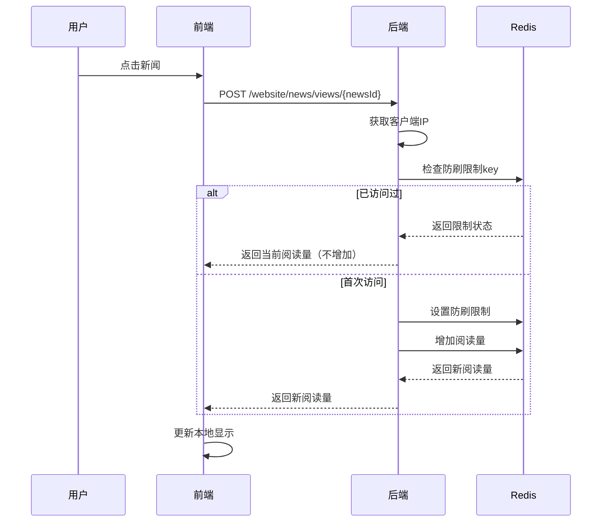
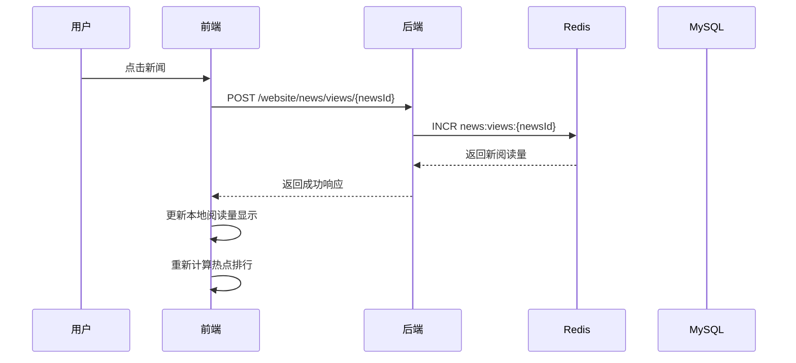
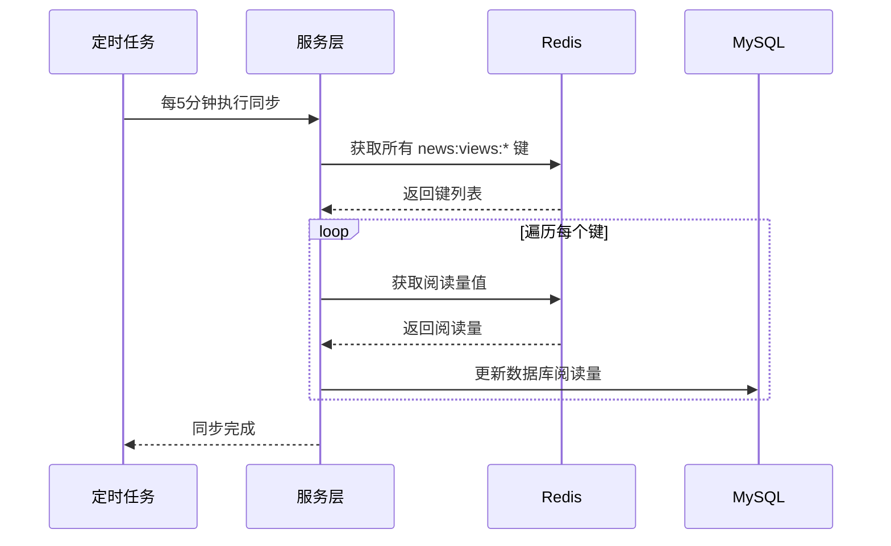
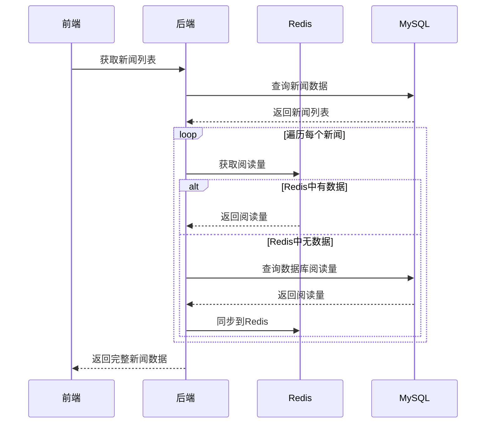

# 热点文章实时更新业务文档

## 📋 目录
- [业务概述](#业务概述)
- [技术架构](#技术架构)
- [核心组件](#核心组件)
- [数据流程](#数据流程)
- [代码实现](#代码实现)
- [配置说明](#配置说明)
- [测试验证](#测试验证)
- [常见问题](#常见问题)

## 🎯 业务概述

### 功能描述
实现新闻文章的实时阅读量统计和热点排行功能，支持高并发访问，确保数据准确性和系统性能。

### 核心特性
- ✅ **实时统计**：用户点击新闻时立即增加阅读量
- ✅ **热点排行**：按阅读量自动排序显示最热门文章
- ✅ **高性能**：Redis缓存 + MySQL持久化架构
- ✅ **数据安全**：定时同步确保数据不丢失
- ✅ **用户体验**：点击即更新，无需刷新页面
- ✅ **防刷机制**：IP限制防止恶意刷量，确保数据真实性

## 🏗️ 技术架构

### 整体架构图
```
┌─────────────────┐    ┌─────────────────┐    ┌─────────────────┐
│   前端 Vue.js   │    │   后端 Spring   │    │   数据存储层    │
│                 │    │                 │    │                 │
│  ┌───────────┐  │    │  ┌───────────┐  │    │  ┌───────────┐  │
│  │ 新闻列表  │  │    │  │ 控制器层  │  │    │  │   Redis   │  │
│  └───────────┘  │    │  └───────────┘  │    │  └───────────┘  │
│                 │    │                 │    │                 │
│  ┌───────────┐  │    │  ┌───────────┐  │    │  ┌───────────┐  │
│  │ 热点排行  │  │◄───┤  │ 服务层    │  │◄───┤  │   MySQL   │  │
│  └───────────┘  │    │  └───────────┘  │    │  └───────────┘  │
│                 │    │                 │    │                 │
│  ┌───────────┐  │    │  ┌───────────┐  │    │  ┌───────────┐  │
│  │ 点击统计  │  │    │  │ 定时任务  │  │    │  │ 数据同步  │  │
│  └───────────┘  │    │  └───────────┘  │    │  └───────────┘  │
└─────────────────┘    └─────────────────┘    └─────────────────┘
```

### 技术栈
- **前端**：Vue.js 2.x + Element UI
- **后端**：Spring Boot + Spring Security
- **缓存**：Redis 6.x
- **数据库**：MySQL 8.0
- **定时任务**：Quartz + Spring Task
- **构建工具**：Maven

## 🔧 核心组件

### 1. 前端组件

#### 新闻显示页面 (`news-display/index.vue`)
```javascript
// 核心计算属性
computed: {
  // 头条新闻列表
  featuredNewsList() {
    return this.newsList.filter(news => news.isFeatured === 'Y')
  },
  
  // 普通新闻列表
  normalNewsList() {
    return this.newsList.filter(news => news.isFeatured !== 'Y')
  },
  
  // 热点排行列表（按阅读量排序）
  hotNewsList() {
    return this.newsList
      .slice()
      .sort((a, b) => (b.views || 0) - (a.views || 0))
      .slice(0, 10)
  }
}
```

#### API服务 (`api/website/news.js`)
```javascript
// 增加新闻阅读量
export function incrementNewsViews(newsId) {
  return request({
    url: '/website/news/views/' + newsId,
    method: 'post',
    headers: { isToken: false }
  })
}

// 获取新闻阅读量
export function getNewsViews(newsId) {
  return request({
    url: '/website/news/views/' + newsId,
    method: 'get',
    headers: { isToken: false }
  })
}
```

### 2. 后端组件

#### 控制器层 (`WebsiteNewsController.java`)
```java
@RestController
@RequestMapping("/website/news")
public class WebsiteNewsController extends BaseController {
    
    @Autowired
    private WebsiteNewsViewsService websiteNewsViewsService;
    
    /**
     * 增加新闻阅读量（公开接口，无需权限，带防刷限制）
     */
    @Anonymous
    @PostMapping("/views/{newsId}")
    public AjaxResult incrementViews(@PathVariable("newsId") Long newsId, HttpServletRequest request) {
        String clientIp = getClientIpAddress(request);
        Long views = websiteNewsViewsService.incrementViewsWithLimit(newsId, clientIp);
        return AjaxResult.success("阅读量增加成功", views);
    }
    
    /**
     * 获取客户端真实IP地址
     */
    private String getClientIpAddress(HttpServletRequest request) {
        // 支持多种代理环境下的真实IP获取
        String xForwardedFor = request.getHeader("X-Forwarded-For");
        if (xForwardedFor != null && !xForwardedFor.isEmpty() && !"unknown".equalsIgnoreCase(xForwardedFor)) {
            return xForwardedFor.split(",")[0].trim();
        }
        // ... 其他IP获取逻辑
        return request.getRemoteAddr();
    }
    
    /**
     * 获取新闻阅读量（公开接口，无需权限）
     */
    @Anonymous
    @GetMapping("/views/{newsId}")
    public AjaxResult getViews(@PathVariable("newsId") Long newsId) {
        Long views = websiteNewsViewsService.getViews(newsId);
        return AjaxResult.success(views);
    }
}
```

#### 服务层 (`WebsiteNewsViewsService.java`)
```java
public interface WebsiteNewsViewsService {
    /**
     * 增加新闻阅读量
     */
    Long incrementViews(Long newsId);
    
    /**
     * 增加新闻阅读量（带防刷限制）
     */
    Long incrementViewsWithLimit(Long newsId, String clientIp);
    
    /**
     * 获取新闻阅读量
     */
    Long getViews(Long newsId);
    
    /**
     * 同步Redis阅读量到MySQL
     */
    void syncViewsToDatabase(Long newsId);
    
    /**
     * 批量同步所有新闻阅读量到MySQL
     */
    void syncAllViewsToDatabase();
}
```

#### 服务实现层 (`WebsiteNewsViewsServiceImpl.java`)
```java
@Service
public class WebsiteNewsViewsServiceImpl implements WebsiteNewsViewsService {
    
    @Autowired
    private RedisCache redisCache;
    
    @Autowired
    private WebsiteNewsMapper websiteNewsMapper;
    
    private static final String NEWS_VIEWS_KEY_PREFIX = "news:views:";
    private static final String VIEW_LIMIT_KEY_PREFIX = "news:view_limit:";
    private static final long VIEWS_CACHE_EXPIRE = 7 * 24 * 60 * 60; // 7天
    private static final long VIEW_LIMIT_EXPIRE = 60 * 60; // 1小时
    
    @Override
    public Long incrementViews(Long newsId) {
        if (newsId == null) return 0L;
        
        String key = NEWS_VIEWS_KEY_PREFIX + newsId;
        Long views = redisCache.increment(key);
        redisCache.expire(key, VIEWS_CACHE_EXPIRE);
        
        return views;
    }
    
    /**
     * 增加新闻阅读量（带防刷限制）
     */
    public Long incrementViewsWithLimit(Long newsId, String clientIp) {
        if (newsId == null || clientIp == null) return 0L;
        
        // 生成防刷限制key：IP + 新闻ID
        String limitKey = VIEW_LIMIT_KEY_PREFIX + clientIp + ":" + newsId;
        
        // 检查是否已经访问过
        if (redisCache.hasKey(limitKey)) {
            // 已经访问过，返回当前阅读量但不增加
            return getViews(newsId);
        }
        
        // 设置防刷限制
        redisCache.setCacheObject(limitKey, "1", (int)VIEW_LIMIT_EXPIRE, TimeUnit.SECONDS);
        
        // 增加阅读量
        return incrementViews(newsId);
    }
    
    @Override
    public Long getViews(Long newsId) {
        if (newsId == null) return 0L;
        
        String key = NEWS_VIEWS_KEY_PREFIX + newsId;
        Object views = redisCache.getCacheObject(key);
        
        if (views == null) {
            // 从数据库获取并同步到Redis
            WebsiteNews news = websiteNewsMapper.selectWebsiteNewsByNewsId(newsId);
            if (news != null && news.getViews() != null) {
                redisCache.setCacheObject(key, news.getViews(), 
                    (int)VIEWS_CACHE_EXPIRE, TimeUnit.SECONDS);
                return news.getViews();
            }
            return 0L;
        }
        
        return Long.valueOf(views.toString());
    }
    
    @Override
    public void syncAllViewsToDatabase() {
        Collection<String> keys = redisCache.keys(NEWS_VIEWS_KEY_PREFIX + "*");
        
        for (String key : keys) {
            String newsIdStr = key.substring(NEWS_VIEWS_KEY_PREFIX.length());
            try {
                Long newsId = Long.valueOf(newsIdStr);
                syncViewsToDatabase(newsId);
            } catch (NumberFormatException e) {
                continue;
            }
        }
    }
}
```

#### 定时任务 (`RyTask.java`)
```java
@Component("ryTask")
public class RyTask {
    
    @Autowired
    private WebsiteNewsViewsService websiteNewsViewsService;
    
    /**
     * 同步新闻阅读量到数据库
     */
    public void syncNewsViews() {
        try {
            websiteNewsViewsService.syncAllViewsToDatabase();
            System.out.println("新闻阅读量同步任务执行成功");
        } catch (Exception e) {
            System.err.println("新闻阅读量同步任务执行失败: " + e.getMessage());
        }
    }
}
```

### 3. 数据层

#### Redis缓存配置
```yaml
# application.yml
spring:
  redis:
    host: localhost
    port: 6379
    database: 0
    password:
    timeout: 10s
    lettuce:
      pool:
        min-idle: 0
        max-idle: 8
        max-active: 8
        max-wait: -1ms
```

#### MySQL表结构
```sql
-- 新闻表
CREATE TABLE website_news (
  news_id         bigint(20)      NOT NULL AUTO_INCREMENT    COMMENT '新闻ID',
  title           varchar(200)    NOT NULL                   COMMENT '标题',
  summary         varchar(500)    DEFAULT ''                 COMMENT '摘要',
  content         text                                       COMMENT '内容',
  category        varchar(50)     DEFAULT ''                 COMMENT '分类',
  image_url       varchar(500)    DEFAULT ''                 COMMENT '图片地址',
  is_featured     char(1)         DEFAULT '0'                COMMENT '是否头条（0否 1是）',
  views           int(11)         DEFAULT 0                  COMMENT '阅读量',
  status          char(1)         DEFAULT '0'                COMMENT '状态（0正常 1停用）',
  create_by       varchar(64)     DEFAULT ''                 COMMENT '创建者',
  create_time     datetime                                   COMMENT '创建时间',
  update_by       varchar(64)     DEFAULT ''                 COMMENT '更新者',
  update_time     datetime                                   COMMENT '更新时间',
  remark          varchar(500)    DEFAULT NULL               COMMENT '备注',
  PRIMARY KEY (news_id)
) ENGINE=InnoDB AUTO_INCREMENT=1 COMMENT = '新闻表';
```

## 🛡️ 防刷机制

### 1. 防刷策略

#### IP + 时间窗口限制
- **同一IP限制**：同一IP地址在指定时间内只能为同一文章增加一次阅读量
- **时间窗口**：1小时内不能重复增加阅读量（演示模式为10秒）
- **精确识别**：支持代理环境下的真实IP获取

#### 防刷流程


### 2. 防刷配置

#### 演示模式配置
```java
// 演示模式开关（true=演示模式，false=生产模式）
private static final boolean DEMO_MODE = true;

// 防刷限制过期时间
// 演示模式：10秒，生产模式：1小时
private static final long VIEW_LIMIT_EXPIRE = DEMO_MODE ? 10 : 60 * 60;
```

#### Redis Key设计
```
防刷限制Key格式：news:view_limit:{clientIp}:{newsId}
阅读量Key格式：news:views:{newsId}
```

### 3. 防刷效果

#### 正常用户行为
```
时间轴：
00:00 - 用户点击新闻A → 阅读量: 100 → 101 ✅
00:05 - 用户再次点击新闻A → 阅读量: 101 (不变) 🛡️
00:15 - 用户点击新闻A → 阅读量: 101 → 102 ✅
```

#### 恶意刷量行为
```
时间轴：
00:00 - 恶意用户点击新闻A → 阅读量: 100 → 101 ✅
00:01 - 恶意用户再次点击 → 阅读量: 101 (不变) 🛡️
00:02 - 恶意用户再次点击 → 阅读量: 101 (不变) 🛡️
00:03 - 恶意用户再次点击 → 阅读量: 101 (不变) 🛡️
...
00:10 - 恶意用户再次点击 → 阅读量: 101 → 102 ✅
```

## 🔄 数据流程

### 1. 用户点击新闻流程


### 2. 定时同步流程


### 3. 数据读取流程


## 💻 代码实现

### 1. 前端核心代码

#### 新闻点击处理
```javascript
// 处理新闻点击
handleNewsClick(news) {
  // 增加阅读量
  this.incrementViews(news.newsId)
  
  this.selectedNews = news
  this.dialogVisible = true
},

// 增加阅读量
async incrementViews(newsId) {
  try {
    const response = await incrementNewsViews(newsId)
    // 根据后端返回的实际阅读量更新本地显示
    this.updateLocalViews(newsId, response.data)
  } catch (error) {
    console.warn('增加阅读量失败:', error)
  }
},

// 更新本地阅读量显示
updateLocalViews(newsId, actualViews) {
  const news = this.newsList.find(item => item.newsId === newsId)
  if (news) {
    // 使用后端返回的实际阅读量，而不是简单+1
    news.views = actualViews || news.views
  }
}
```

#### 阅读量格式化
```javascript
// 格式化阅读量
formatViews(views) {
  if (!views) return '0'
  if (views >= 10000) {
    return (views / 10000).toFixed(1) + '万'
  } else if (views >= 1000) {
    return (views / 1000).toFixed(1) + 'k'
  }
  return views.toString()
}
```

### 2. 后端核心代码

#### Redis工具类扩展
```java
// RedisCache.java 新增方法
/**
 * 递增
 */
public Long increment(final String key) {
    return redisTemplate.opsForValue().increment(key);
}

/**
 * 递增指定值
 */
public Long increment(final String key, final long delta) {
    return redisTemplate.opsForValue().increment(key, delta);
}
```

#### 数据库映射
```xml
<!-- WebsiteNewsMapper.xml -->
<update id="updateWebsiteNewsViews" parameterType="WebsiteNews">
    update website_news 
    set views = #{views}
    where news_id = #{newsId}
</update>
```

## ⚙️ 配置说明

### 1. 定时任务配置

#### 通过后台管理界面配置
1. 访问 `http://localhost/monitor/job`
2. 点击"新增"按钮
3. 填写配置信息：
   ```
   任务名称：新闻阅读量同步
   任务组名：DEFAULT
   调用目标字符串：ryTask.syncNewsViews
   cron执行表达式：0 */5 * * * ?
   计划执行错误策略：放弃执行
   是否并发执行：禁止
   状态：正常
   备注：每5分钟同步一次新闻阅读量数据从Redis到MySQL
   ```

#### 通过SQL脚本配置
```sql
INSERT INTO sys_job VALUES(
    4, 
    '新闻阅读量同步', 
    'DEFAULT', 
    'ryTask.syncNewsViews', 
    '0 */5 * * * ?', 
    '3', 
    '1', 
    '0', 
    'admin', 
    sysdate(), 
    '', 
    null, 
    '每5分钟同步一次新闻阅读量数据从Redis到MySQL'
);
```

### 2. 模块依赖配置

#### ruoyi-quartz/pom.xml
```xml
<!-- 添加系统模块依赖 -->
<dependency>
    <groupId>com.ruoyi</groupId>
    <artifactId>ruoyi-system</artifactId>
</dependency>
```

### 3. 权限配置

#### 白名单配置 (permission.js)
```javascript
const whiteList = [
  '/login', 
  '/register', 
  '/website/home', 
  '/website/about', 
  '/website/services', 
  '/website/facilities', 
  '/website/news-display', 
  '/website/contact', 
  '/website/appointment', 
  '/website/family-login'
]
```

## 🧪 测试验证

### 1. 功能测试

#### 阅读量统计测试
1. **点击新闻**：点击任意新闻，检查阅读量是否+1
2. **实时更新**：检查热点排行是否实时更新排序
3. **数据持久化**：重启应用后检查阅读量是否保持

#### 防刷机制测试
1. **正常点击**：第一次点击新闻，阅读量正常增加
2. **重复点击**：立即重复点击同一新闻，阅读量不变
3. **时间窗口**：等待限制时间后再次点击，阅读量可以增加
4. **不同IP**：使用不同IP访问，阅读量正常增加
5. **前后端同步**：检查前端显示与后端实际值是否一致

#### 定时同步测试
1. **手动触发**：在后台管理界面手动执行定时任务
2. **自动执行**：等待5分钟检查是否自动同步
3. **数据一致性**：检查Redis和MySQL数据是否一致

### 2. 性能测试

#### 并发测试
```bash
# 使用ab工具进行并发测试
ab -n 1000 -c 100 http://localhost/website/news/views/1
```

#### 压力测试
- **目标**：支持1000+并发用户
- **响应时间**：< 100ms
- **数据准确性**：100%准确

### 3. 监控指标

#### 关键指标
- **Redis命中率**：> 95%
- **同步延迟**：< 5分钟
- **错误率**：< 0.1%
- **响应时间**：< 100ms

## ❓ 常见问题

### 1. 编译错误

#### 问题：模块依赖错误
```
java: 程序包com.ruoyi.system.service不存在
```
**解决方案**：在`ruoyi-quartz/pom.xml`中添加对`ruoyi-system`的依赖

#### 问题：类型转换错误
```
java: 不兼容的类型: java.util.Collection<java.lang.String>无法转换为java.util.Set<java.lang.String>
```
**解决方案**：将`Set<String>`改为`Collection<String>`

### 2. 运行时错误

#### 问题：Redis连接失败
```
Could not get a resource from the pool
```
**解决方案**：
1. 检查Redis服务是否启动
2. 检查Redis配置是否正确
3. 检查网络连接

#### 问题：定时任务不执行
**解决方案**：
1. 检查定时任务是否启动
2. 检查cron表达式是否正确
3. 检查任务状态是否为"正常"

### 3. 数据问题

#### 问题：阅读量不准确
**解决方案**：
1. 检查Redis数据是否正常
2. 检查定时同步是否执行
3. 检查数据库更新是否成功

#### 问题：热点排行不更新
**解决方案**：
1. 检查前端计算属性是否正确
2. 检查数据绑定是否正常
3. 检查Vue响应式更新

#### 问题：防刷机制不生效
**解决方案**：
1. 检查Redis连接是否正常
2. 检查防刷限制Key是否正确设置
3. 检查时间窗口配置是否正确
4. 检查IP获取逻辑是否准确

#### 问题：前端显示与后端不一致
**解决方案**：
1. 检查前端是否正确使用后端返回的实际阅读量
2. 检查API响应数据格式是否正确
3. 检查前端更新逻辑是否合理

## 📚 学习要点

### 1. 技术要点
- **Redis原子操作**：使用INCR确保并发安全
- **Vue计算属性**：实现响应式数据更新
- **Spring定时任务**：Quartz框架的使用
- **模块化设计**：前后端分离架构
- **防刷机制**：IP限制和时间窗口控制
- **前后端同步**：确保数据一致性

### 2. 业务要点
- **用户体验**：实时更新，无需刷新
- **数据一致性**：Redis缓存 + MySQL持久化
- **性能优化**：缓存策略，减少数据库压力
- **容错处理**：异常情况下的降级处理
- **数据真实性**：防刷机制确保阅读量真实可靠
- **安全防护**：防止恶意刷量，保护系统稳定

### 3. 扩展方向
- **分布式部署**：Redis集群，数据库主从
- **监控告警**：添加业务监控和异常告警
- **数据分析**：阅读量趋势分析，用户行为分析
- **缓存优化**：LRU策略，过期时间优化

---

## 📝 总结

热点文章实时更新业务是一个典型的**高并发、实时性要求高**的业务场景。通过Redis缓存 + MySQL持久化的架构，既保证了性能，又确保了数据的可靠性。前端使用Vue的响应式特性实现实时更新，后端通过定时任务保证数据一致性，整个系统设计合理，扩展性强。

**核心价值**：
- 🚀 **高性能**：Redis缓存，支持高并发
- 🔄 **实时性**：点击即更新，用户体验好
- 🛡️ **可靠性**：数据持久化，不会丢失
- 📈 **可扩展**：模块化设计，易于扩展
- 🔒 **安全性**：防刷机制，确保数据真实
- ⚖️ **一致性**：前后端数据完全同步

这个业务实现展示了现代Web应用开发的最佳实践，值得深入学习和应用。


